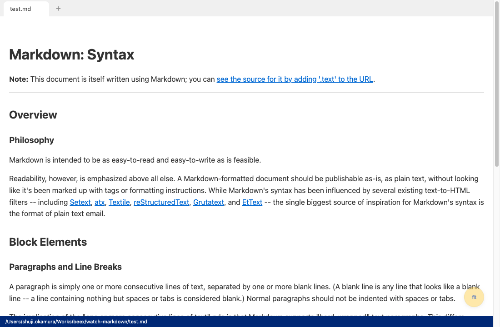
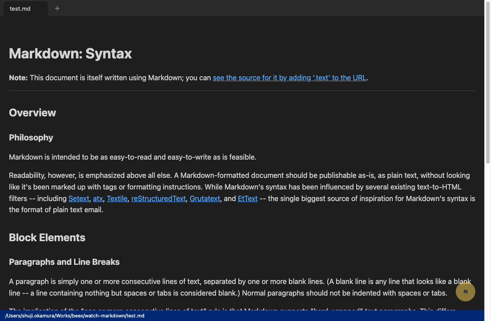
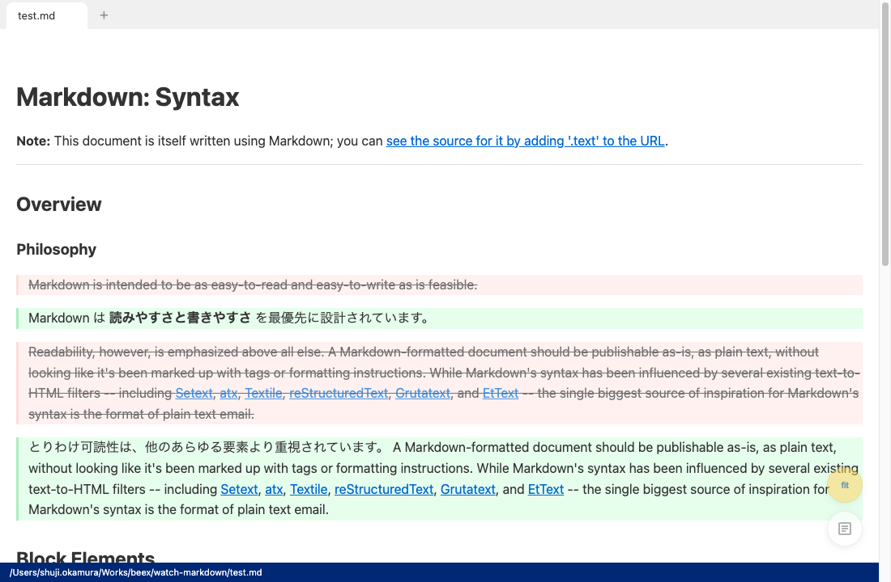
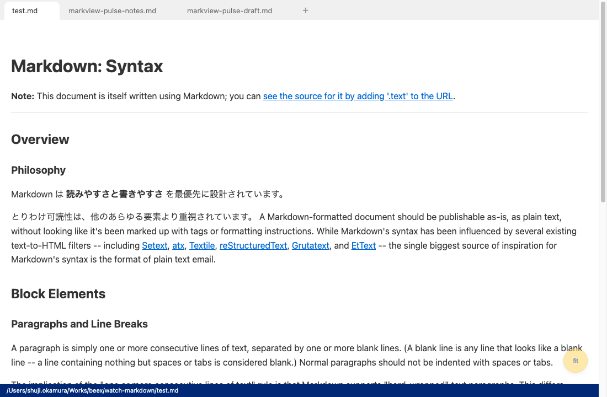
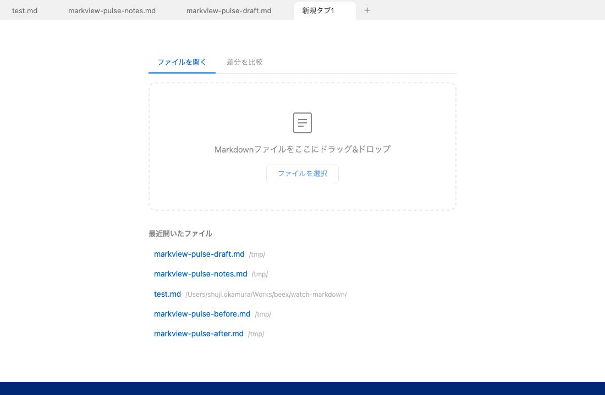
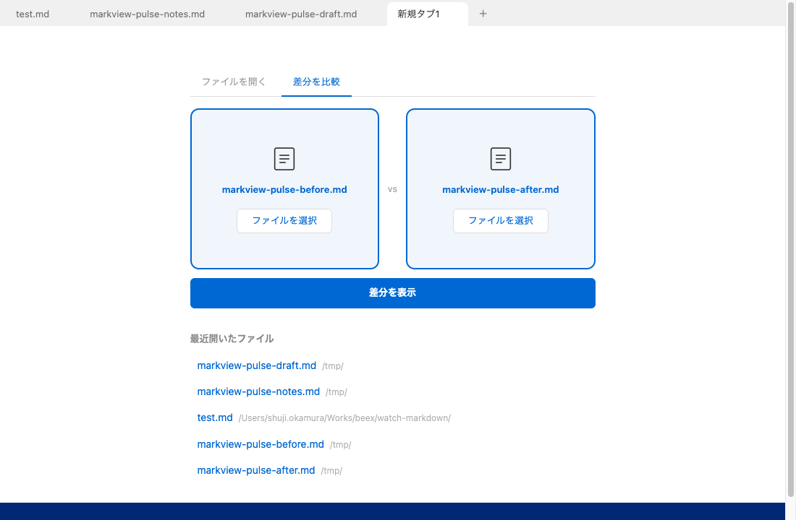

# Markview Pulse

Markdownファイルをリアルタイムにプレビューするデスクトップアプリです（macOS / Windows / Linux対応）。ファイルの変更を即座に検知して表示を更新し、変更箇所をインライン差分で確認できます。複数ファイルを同時に開けるタブUIと、任意の2ファイルを並べて比較する差分モードも備えています。

## ダウンロード

[最新リリース](https://github.com/beex-okamura/markview-pulse/releases/latest)からお使いのOS向けのファイルをダウンロードしてください。

| OS | ファイル |
|---|---|
| macOS (Apple Silicon) | `.dmg` |
| Windows | `.exe` |
| Linux | `.AppImage` / `.deb` |

## スクリーンショット

### ライトモード


### ダークモード


### 差分表示（自動検知）
ファイル更新時に変更箇所をインラインで強調表示します。



### タブUI
複数のMarkdownファイルをタブで切り替えながら閲覧できます。アクティブタブのフルパスは下部のステータスバーに表示されます。



### ウェルカムタブ
`+`ボタンや全タブを閉じた直後に表示される起点画面です。ドロップゾーン・ファイル選択ボタン・最近開いたファイル一覧をまとめています。



### 差分比較モード
ウェルカムタブの「差分を比較」に切り替えると、任意の2つのMarkdownファイルを並べて差分表示できます。



## 機能一覧

- Markdownファイルのリアルタイムプレビュー
- ファイル変更の自動検知・表示更新（mtimeポーリング方式）
- インライン差分表示（追加: 緑 / 削除: 赤+取り消し線）
- タブUI（複数ファイルを同時に開いて切り替え）
- ステータスバー（アクティブタブのフルパス表示）
- ウェルカムタブ（ドロップゾーン + 最近開いたファイル一覧）
- 差分比較モード（任意の2ファイルを選んで差分を確認）
- ダークモード対応（OSのシステム設定に連動）
- ファイルのドラッグ&ドロップ
- 印刷 / PDF書き出し
- テーブル表示（罫線付き・横スクロール対応・セル単位の差分強調）
- コンテンツ幅の切り替え（max / fit）
- スクロール位置の保持（ファイル更新時）
- `.md` ファイル関連付け
- CJK括弧（「」など）に隣接した `**強調**` の正常レンダリング

## 必要な環境

- Node.js 20 以上
- npm

## インストール手順

```bash
git clone https://github.com/beex-okamura/markview-pulse.git
cd markview-pulse
npm install
```

## ビルド・パッケージング

```bash
# TypeScriptコンパイルのみ
npm run build

# ローカル環境向けにパッケージング
npm run pack

# インストーラーを生成（dmg / exe / AppImage / deb）
npm run dist
```

## 使い方

### 起動方法

```bash
# コマンドラインからファイルを指定して起動
npx electron . ファイル.md

# 開発用（test.mdを開く）
npm run dev
```

- **ファイル関連付け**:
  - **macOS**: Finderで `.md` ファイルを右クリック →「情報を見る」→「このアプリケーションで開く」で `Markview Pulse` を選択 →「すべてを変更」
  - **Windows**: `.md` ファイルを右クリック →「プログラムから開く」→「別のプログラムを選択」で `Markview Pulse` を選択 →「常にこのアプリを使って.mdファイルを開く」にチェック
  - **Linux**: インストール時に自動で関連付けされます
- **ドラッグ&ドロップ**: アプリのウィンドウやウェルカムタブのドロップゾーンに `.md` ファイルをドロップ

### キーボードショートカット

| ショートカット | 機能 |
|---|---|
| `Cmd/Ctrl + P` | 印刷 |
| `Cmd/Ctrl + Shift + S` | PDF書き出し |
| `Cmd/Ctrl + W` | アクティブタブを閉じる |
| `Ctrl + Tab` | 次のタブへ移動 |
| `Ctrl + Shift + Tab` | 前のタブへ移動 |
| `Cmd/Ctrl + 1` 〜 `9` | 番号でタブを切り替え |
| `Cmd/Ctrl + +` | 拡大 |
| `Cmd/Ctrl + -` | 縮小 |
| `Cmd/Ctrl + 0` | 実際のサイズ |

### タブとウェルカムタブ

- タブバー右端の `+` をクリックすると、新しいウェルカムタブが開きます
- ウェルカムタブにはドロップゾーンとともに「最近開いたファイル」一覧が表示されます
- すべてのタブを閉じるとウェルカムタブが自動表示されます
- ウェルカムタブからファイルを開くと、そのウェルカムタブが対象ファイルのタブに置き換わります

### 差分表示

差分の表示方法は2種類あります。

**1. ファイル更新時の自動差分**
ファイルが更新されると、前回との差分が自動的にインライン表示されます。

- 緑背景: 追加された部分
- 赤背景+取り消し線: 削除された部分
- 右下のトグルボタンで通常表示と差分表示を切り替えられます

**2. 任意の2ファイルを比較**
ウェルカムタブの「差分を比較」モードに切り替えて、変更前・変更後のMarkdownファイルをそれぞれ指定すると、専用の差分タブで比較できます。

### コンテンツ幅の切り替え

右下のボタンでコンテンツ幅を切り替えられます。

| ボタン表示 | 説明 |
|---|---|
| `max` | ウィンドウ全幅で表示 |
| `fit` | 1200px幅で中央寄せ |

## 開発

### 開発環境セットアップ

```bash
npm install
npm run build
```

### テストの実行

差分生成ロジックをvitestでユニットテストしています。

```bash
npm test
```

### プロジェクト構成

```
markview-pulse/
├── src/
│   ├── main.ts          # Electronメインプロセス（タブ管理・ファイル監視・差分生成）
│   ├── preload.ts       # IPC通信のブリッジ
│   ├── renderer.ts      # 表示・タブUI・ウェルカムタブ・差分切り替え・ドラッグ&ドロップ
│   ├── diff.ts          # 差分HTML生成（テーブルはセル単位で差分強調）
│   ├── diff-slots.ts    # 差分比較モードのスロット遷移ロジック
│   ├── index.html       # ビューアのHTML
│   └── style.css        # スタイル（ライト/ダーク・タブ・差分・ウェルカムタブ）
├── test/
│   ├── diff.test.ts        # 差分生成のユニットテスト
│   └── diff-slots.test.ts  # 差分比較スロット遷移のユニットテスト
├── scripts/
│   └── screenshot-readme.mjs  # README用スクリーンショット撮影スクリプト
├── dist/                # コンパイル済みJS / パッケージング出力
├── package.json
├── tsconfig.json
└── vitest.config.ts
```

## 技術スタック

- [Electron](https://www.electronjs.org/) - デスクトップアプリフレームワーク
- [TypeScript](https://www.typescriptlang.org/) - 型付きJavaScript
- [marked](https://marked.js.org/) - Markdown→HTML変換
- [diff](https://github.com/kpdecker/jsdiff) - テキスト差分検出
- [vitest](https://vitest.dev/) - ユニットテスト
- [electron-builder](https://www.electron.build/) - パッケージング

## ライセンス

ISC
